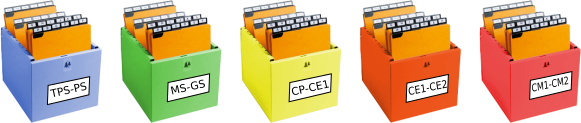

# Biblioteca Calandreta Paulina

___

## Fonctionnement de la bibliothèque d'école Calandreta Pau

La bibliothèque fonctionne avec très peu de moyen humain. Des bénévoles assurent
le traitement des acquisitions des livres, ainsi qu'un peu de rangement. Les 
utilisateurs de la bibliothèque (élèves et enseignant) doivent pouvoir la faire
vivre quasiment en autonomie (donc gérer les emprunts et le rangement).

### Catalogage
Les livres sont catalogués manuellement sur [Tellico][]. La fonction de récupération 
en ligne de données bibliographique n'est pas utilisée pour le moment. Nous
ne disposons pas de lecteur de code barre. Voir les Questions/Réponses sur ce 
sujet [plus bas dans ce document](#les-données-bibliographiques-sont-elles-récupérées-en-ligne)

### Consultation du catalogue
Une [page internet générée à partir du catalogue][] est disponible en ligne sur
le site de l'école. C'est le script [web.sh][] qui génère et met en ligne cette 
page. [Anacron][] lance ce script tous les jours ou quelqu'un allume l'ordinateur

### Sauvegarde du catalogue
Le script [github_backup.sh][] permet de sauvegarder sur github le 
[fichier de catalogage][]. [Anacron][] lance ce script tous les jours ou 
quelqu'un allume l'ordinateur

### Gestion des emprunts
La gestion des emprunts de livre ne se fait pas informatiquement, mais __grâce
à des fiches__. La fonction de gestion des emprunts de Tellico n'est pas utilisée. 

Nous considérons qu'un livre est prêté à une classe (ex: la classe de CP), pas à 
un élève en particulier. Dans la bibliothèque il y a donc une boite pour
chacune des cinq classes de l'école. 

Dans la boite d'une classe se trouvent les fiches de tous les livres empruntés 
par les élèves de cette classe.

Cette organisation n'a pas été choisie faute de moyen informatiques pour
gérer les emprunts, mais pour permettre un fonctionnement courant de la 
bibliothèque avec très peu de moyen humain. Voir les Questions / Réponses
sur ce sujet [plus bas dans ce document](#pourquoi-une-gestion-des-prêts-par-fiches).

### Traitement des acquisitions de la bibliothèque

Les nouveaux livres qui sont acquis par la bibliothèque suivent le processus
suivant

1. Nettoyage
2. Réparation si nécessaire
3. Couverture
4. Ajout d'un bandeau horizontal de couleur en haut du dos si le livre n'est pas 
  en français  
    * occitan: rouge.
    * langue étrangère : jaune.
    * bilingue français/occitan ou français/étranger :  le bandeau est rouge ou 
      jaune selon la langue, mais il est barré d'un trait blanc sur toute sa
      longueur.
5. Ajout d'une pochette en fin de livre, qui permet de glisser la fiche
6. Catalogage sur Tellico
7. Impression et mise en place de la fiche
8. Impression et mise en place de la cote
9. Rangement dans le rayon

[Tellico]:http://tellico-project.org/
[CodeSource]:CodeSource
[impression.py]:CodeSource/impression.py
[web.sh]:CodeSource/web.sh
[github_backup.sh]:CodeSource/github_backup.sh
[fichier de catalogage]:inventaire.tc
[rename_authors.py]:CodeSource/rename_authors.py
[anacron]:http://www.delafond.org/traducmanfr/man/man8/anacron.8.html
[wkhtmltopdf]:https://wkhtmltopdf.org/
[page internet générée à partir du catalogue]:http://calandreta-pau.org/bibli/

___

## Questions / Réponses

### Pourquoi Tellico pour le catalogage?
Le logiciel utilisé pour le catalogage devait répondre au cahier des charges
suivant:

* __Disponible hors-ligne__ :
  * L'ordinateur de la bibliothèque n'était pas connecté à internet ni 
  * au réseau local au début du projet
  * Nous ne souhaitons pas dépendre d'une connexion réseau disponible pour le
    catalogage.
  * Nous sommes frileux pour confier l'hébergement de nos données à un tiers.
    Il faut en tout cas pouvoir les exporter facilement vers un nouveau
    logiciel si besoin. Tellico permet l'export dans de nombreux formats,
    dont le csv, qui est très répandu.
* __Prise en main facile__ pour les enseignants, les bénévoles, et les élèves
* __Gestion des doublons__ : Lors du catalogage, nous voulions détecter
  le nombre d'exemplaire de chaque livre. Le logiciel choisi devait nous aider
  dans cette tâche. L'auto-complétion avec liste de suggestion, disponible dans 
  Tellico nous assiste efficacement dans cette tâche

Dans un premier temps, nous avons commencé à utiliser une simple feuille
`libreoffice calc`. Puis nous avons migré vers Tellico pour la simplicité
et la convivialité de son interface.

### Les données bibliographiques sont-elles récupérées en ligne?

Tellico permet la récupération des données bibliographiques sur des serveurs, 
comme par exemple le serveur de la BNF. Nous n'utilisons pas cette 
fonctionnalité pour le moment.

Dans notre cas en effet, le nombre de données à saisir pour chaque livre est
relativement peu important (Titre, Auteur, Éditeur, Langue). Nos données de 
catalogage comprennent aussi des informations qui ne sont pas disponibles sur
le serveur BNF: code de rangement interne, statut de l'impression des fiches,
nombre d'exemplaires dans notre stock.
Enfin, le serveur BNF ne met pas l'illustrateur des livres dans les
auteurs, mais dans les commentaires, ce qui ne correspond pas à notre logique.
(nous voulons pouvoir regrouper les livres par illustrateur aussi).

Au total, il aurait fallu systématiquement remodifier les données importées du
serveur, le gain de temps nous semble incertain. Il est cependant possible que
nous utilisions à l'avenir cette fonctionnalité de Tellico pour compléter nos
données bibliographique.

### Pourquoi une gestion des prêts par fiches?
21è siècle, l'ère du code-barre. Et pourtant!

Loin du modèle de bibliothèque classique avec un ou plusieurs employés pour
gérer le stock, les prêts et le rangement des livres, notre bibliothèque repose
sur le bénévolat quand il est disponible, les enseignants et les élèves le reste
du temps. La ou les personnes qui viennent emprunter des livres ont de grandes
chances de se trouver seule(s) dans la bibliothèque.

Dans ce contexte, demander aux élèves ou aux enseignants d'allumer l'ordinateur,
de lancer le programme, d'identifier la classe et de scanner les codes barres
nécessaires relève presque de l'utopie.
La logique "Mets la fiche dans la boite de ta classe avant d'emporter le livre"
nous a semblé plus accessible pour les enseignants et surtout les élèves.
Bien sur il y aura des ratés, des fiches pas rangées, mais l'objectif au 
sein de l'école est d'avoir un système de prêt qui permet le plus de souplesse
possible dans la pratique, plutôt qu'un système _théoriquement_ très rigoureux.

